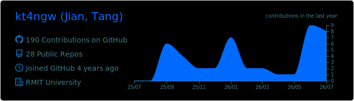

👋 Hello, here is kt4ngw (Jian Tang), my page is https://kt4ngw.github.io/.

- 📌 Ph.D. student in the School of Computing Technologies at RMIT University, Melbourne, Australia.
- 🙋‍♂️ M.S. Software Engineering, Chongqing University, Chongqing, China (Jun. 2025); B.S. Engineering, Hunan University of Technology and Business, Changsha, China (Jun. 2022).
- 🌱 Current research interests include **Federated Learning (FL), Edge Intelligence, FL for LLM, Network & System Security**.
- 👀 Please do not hesitate to contact me with any questions.
- 📧 Email: kt4ngw@gmail.com(mainly). (Please state your affiliation and name and indicate your intention.)
- ✨ Progressing together, please!⚡⚡⚡⚡⚡⚡
- 👍 Last but not least, to learn & to cope (that's my motto)!

|  |  |
| ------------------------------------------------------------ | ------------------------------------------------------------ |

<!--
**kt4ngw/kt4ngw** is a ✨ _special_ ✨ repository because its `README.md` (this file) appears on your GitHub profile.

Here are some ideas to get you started:
- 👋 Hi, I’m @kt4ngw，
- 👀 I’m interested in ML, alogrithm
- 🌱 I’m currently learning ML and
- 📫 How to reach me: ...
- 😄 Pronouns: ...📌 
- ⚡ Fun fact: ...

-->
